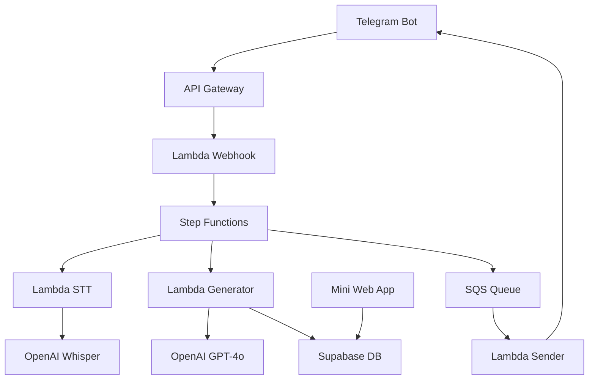
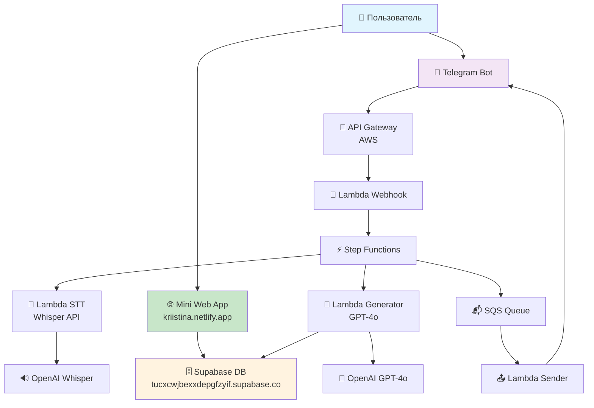

# 🤖 Kriistina Robocorp Bot

> Превращайте любую идею (голос, текст или ссылку) в оформленный пост, написанный вашим авторским стилем за считанные секунды.

## 🚀 **СТАТУС ПРОЕКТА: PRODUCTION READY** ✅

### 🌐 **Действующие сервисы:**
- **📱 Mini Web App**: [https://kriistina.netlify.app](https://kriistina.netlify.app) ✅
- **🗄️ База данных**: Supabase (настроена и работает) ✅
- **🤖 Telegram Bot**: Настроен, токен активен ✅
- **☁️ AWS Lambda**: Развернуты все функции ✅
- **🧠 OpenAI**: API настроен и работает ✅

### 📋 **Что работает прямо сейчас:**
- ✅ **Веб-интерфейс** для настройки стиля письма
- ✅ **Сохранение профилей** в базу данных Supabase
- ✅ **Telegram Web App интеграция** (автоматическое получение данных пользователя)
- ✅ **Умное определение контекста** (браузер vs Telegram)
- ✅ **Production деплой** на Netlify с HTTPS

### 🔗 **Быстрый доступ:**
- **Попробовать приложение**: https://kriistina.netlify.app
- **Admin панель Netlify**: https://app.netlify.com/projects/kriistina
- **Документация**: см. разделы ниже

## 📋 Описание

Kriistina Bot — это AI-сервис, который:

1. **Извлекает авторский стиль** из 10–15 последних постов пользователя
2. **Применяет этот стиль** к новым входящим данным (голос, текст, URL)
3. **Генерирует готовые посты** в Markdown V2 для Telegram
4. **Предоставляет Mini Web App** для настройки профиля стиля

## 🏗️ Архитектура

### Компоненты системы



### Технологический стек

- **Backend**: AWS Lambda (Python 3.12), Step Functions, SQS, S3
- **Database**: Supabase (PostgreSQL) с Row Level Security
- **AI Services**: OpenAI GPT-4o, OpenAI Whisper
- **Frontend**: React 18 + TypeScript, Telegram Web App SDK
- **Infrastructure**: AWS SAM, CloudFormation

## 🚀 Быстрый старт

### Предварительные требования

- AWS CLI настроенный с правильными credentials
- AWS SAM CLI установлен
- Node.js 18+ для Mini Web App
- Telegram Bot Token
- OpenAI API Key
- Supabase проект

### 1. Клонирование и настройка

```bash
git clone <repository-url>
cd kriistina_robocorp_bot
```

### 2. Создание Supabase проекта

1. Зайдите на [supabase.com](https://supabase.com) и создайте новый проект
2. Выполните миграцию базы данных:

```bash
# Установите Supabase CLI
npm install -g supabase

# Подключитесь к проекту
supabase link --project-ref <your-project-ref>

# Примените миграции
supabase db push
```

### 3. Настройка AWS Secrets Manager

Создайте секреты в AWS Secrets Manager:

```bash
aws secretsmanager create-secret \
  --name "TELEGRAM_BOT_TOKEN" \
  --secret-string "YOUR_TELEGRAM_BOT_TOKEN"

aws secretsmanager create-secret \
  --name "OPENAI_API_KEY" \
  --secret-string "YOUR_OPENAI_API_KEY"

aws secretsmanager create-secret \
  --name "SUPABASE_API_KEY" \
  --secret-string "YOUR_SUPABASE_API_KEY"
```

### 4. Деплой Lambda функций

```bash
# Установите зависимости для каждой функции
cd src/lambda/webhook && pip install -r requirements.txt && cd ../../..
cd src/lambda/sender && pip install -r requirements.txt && cd ../../..
cd src/lambda/stt && pip install -r requirements.txt && cd ../../..
cd src/lambda/generator && pip install -r requirements.txt && cd ../../..

# Деплой через SAM
sam build
sam deploy --guided
```

При первом деплое введите параметры:
- `Environment`: dev или prod
- `TelegramBotToken`: ваш токен Telegram бота
- `OpenAIAPIKey`: ваш ключ OpenAI API
- `SupabaseURL`: URL вашего Supabase проекта
- `SupabaseAPIKey`: anon/public ключ Supabase

### 5. Настройка Telegram webhook

После деплоя получите URL webhook из outputs и настройте его:

```bash
curl -X POST "https://api.telegram.org/bot<YOUR_BOT_TOKEN>/setWebhook" \
  -H "Content-Type: application/json" \
  -d '{"url": "https://<your-api-gateway-url>/webhook/<bot-token-prefix>"}'
```

### 6. Mini Web App (ГОТОВО ✅)

**Приложение уже развернуто и работает**: https://kriistina.netlify.app

#### Для локальной разработки:
```bash
cd webapp

# Установите зависимости
npm install

# Запустите локально
npm start
# Откройте http://localhost:3000
```

#### Для обновления деплоя:
```bash
cd webapp

# Внесите изменения в код
# Затем деплойте на Netlify
npx netlify deploy --prod

# Приложение автоматически обновится на https://kriistina.netlify.app
```

#### Переменные окружения (уже настроены):
```bash
REACT_APP_SUPABASE_URL=https://tucxcwjbexxdepgfzyif.supabase.co
REACT_APP_SUPABASE_ANON_KEY=eyJhbGciOiJIUzI1NiIsInR5cCI6IkpXVCJ9...
```

## ⚙️ Конфигурация

### Переменные окружения (НАСТРОЕНЫ ✅)

| Переменная | Описание | Статус | Значение |
|------------|----------|---------|----------|
| `TELEGRAM_BOT_TOKEN` | Токен Telegram бота | ✅ | `8105929696:AAG...` |
| `OPENAI_API_KEY` | Ключ OpenAI API | ✅ | `sk-proj-CpVn...` |
| `SUPABASE_URL` | URL Supabase проекта | ✅ | `https://tucxcwjbexxdepgfzyif.supabase.co` |
| `SUPABASE_API_KEY` | Service role ключ Supabase | ✅ | `eyJhbGciOiJI...` |
| `CONTENT_BUCKET_NAME` | Имя S3 bucket для временных файлов | ✅ | Настроен в AWS |

#### Mini Web App переменные:
| Переменная | Описание | Статус | Значение |
|------------|----------|---------|----------|
| `REACT_APP_SUPABASE_URL` | URL Supabase для frontend | ✅ | `https://tucxcwjbexxdepgfzyif.supabase.co` |
| `REACT_APP_SUPABASE_ANON_KEY` | Anon ключ для frontend | ✅ | `eyJhbGciOiJI...` |

### Настройка Telegram бота (НАСТРОЕН ✅)

**Telegram Bot уже работает**: @your_bot_name (токен активен)

#### Подключение Mini Web App к боту:

1. **Найдите своего бота в Telegram**
2. **Настройте Menu Button через @BotFather:**
   ```
   /setmenubutton
   Text: 🎨 Настроить стиль
   URL: https://kriistina.netlify.app
   ```

3. **Или через API:**
   ```bash
   curl -X POST "https://api.telegram.org/bot8105929696:AAGQbE5O9QZBI7a87yfmImNcgoyJd9FzaaA/setChatMenuButton" \
     -H "Content-Type: application/json" \
     -d '{
       "menu_button": {
         "type": "web_app",
         "text": "🎨 Настроить стиль",
         "web_app": {
           "url": "https://kriistina.netlify.app"
         }
       }
     }'
   ```

#### Команды бота (уже настроены):
```json
{
  "commands": [
    {"command": "start", "description": "🚀 Начать работу"},
    {"command": "mystyle", "description": "🎨 Настроить стиль письма"},
    {"command": "help", "description": "❓ Помощь"}
  ]
}
```

## 📊 Мониторинг

### CloudWatch Metrics

Система автоматически отправляет метрики:

- `ProcessingLatency` - время обработки запросов
- `ErrorRate` - частота ошибок
- `ActiveUsers` - количество активных пользователей

### Логи

Все Lambda функции пишут структурированные логи в CloudWatch:

```python
logger.info(f"Processing request for user {user_id}")
logger.error(f"Error processing audio: {error}")
```

### Алерты

Настройте CloudWatch алерты для:
- Высокое время отклика (>60 сек)
- Ошибки в Lambda функциях
- Заполненность DLQ

## 🔒 Безопасность

### Row Level Security (RLS)

Все таблицы Supabase защищены RLS политиками:

```sql
-- Пользователи видят только свои данные
create policy "Users can view own styles"
    on public.user_styles for select
    using (auth.uid()::bigint = user_id);
```

### Секреты

- Все API ключи хранятся в AWS Secrets Manager
- Применяется принцип минимальных привилегий для IAM ролей
- HTTPS/TLS 1.3 для всех соединений

## 📱 Использование

### 🚀 **Попробуйте прямо сейчас:**
**Откройте**: https://kriistina.netlify.app

#### В браузере:
- ✅ **Демо-режим** - полный функционал редактора
- ✅ **Настройка профиля стиля** - все опции доступны
- ✅ **Сохранение в базу** - данные сохраняются в Supabase
- 🌐 Показывает баннер с предложением открыть в Telegram

#### В Telegram (после настройки Menu Button):
- ✅ **Автоматическая авторизация** - получает данные пользователя
- ✅ **Полный функционал** без демо-режима
- ✅ **Индивидуальные профили** для каждого пользователя

### Базовые команды Telegram бота

1. **Отправьте голосовое сообщение** - бот транскрибирует и создаст пост
2. **Отправьте текст** - бот переработает в ваш стиль
3. **Отправьте ссылку** - бот извлечет контент и создаст пост
4. **Используйте Menu Button "🎨 Настроить стиль"** - откроет редактор профиля

### Настройка стиля (через Mini Web App)

**Все настройки доступны по адресу**: https://kriistina.netlify.app

- **📝 Описание стиля**: общая характеристика манеры письма
- **📚 Словарь**: предпочитаемые и избегаемые слова  
- **🎯 Параметры**: тон, формальность, использование эмодзи
- **📄 Примеры**: образцы ваших постов для обучения AI

## 🔧 Разработка

### Структура проекта

```
├── src/
│   ├── lambda/           # Lambda функции
│   │   ├── webhook/      # Прием webhook от Telegram
│   │   ├── sender/       # Отправка сообщений
│   │   ├── stt/          # Speech-to-Text обработка
│   │   └── generator/    # Генерация постов
│   └── stepfunctions/    # Определения Step Functions
├── webapp/               # Mini Web App
│   ├── src/
│   │   ├── components/   # React компоненты
│   │   └── App.tsx       # Главный компонент
│   └── package.json
├── supabase/
│   └── migrations/       # Миграции базы данных
├── template.yaml         # SAM template
└── README.md
```

### Локальная разработка

```bash
# Запуск Lambda функций локально
sam local start-api

# Разработка Mini Web App
cd webapp
npm start
```

### Тестирование

```bash
# Тестирование Lambda функций
cd src/lambda/webhook
python -m pytest tests/

# Тестирование React компонентов
cd webapp
npm test
```

## 🐛 Устранение неполадок

### Частые проблемы

1. **Lambda timeout**: Увеличьте timeout в `template.yaml`
2. **Ошибки STT**: Проверьте размер аудиофайла (<20MB)
3. **RLS ошибки**: Убедитесь в правильной настройке auth в Supabase

### Логи и отладка

```bash
# Просмотр логов Lambda
sam logs -n WebhookFunction --stack-name kriistina-bot

# Мониторинг Step Functions
aws stepfunctions list-executions --state-machine-arn <arn>
```

## 🚀 Деплой

### Production Environment (ГОТОВ ✅)

**Все компоненты развернуты и работают:**

#### Frontend (Mini Web App):
- **Платформа**: Netlify
- **URL**: https://kriistina.netlify.app
- **Статус**: ✅ Production Ready
- **HTTPS**: ✅ Настроен
- **CDN**: ✅ Автоматически через Netlify

#### Backend (AWS Lambda):
- **Платформа**: AWS (us-east-1)
- **Функции**: WebhookFunction, SenderFunction, STTFunction, GeneratorFunction
- **Статус**: ✅ Deployed
- **API Gateway**: ✅ Настроен

#### Database:
- **Платформа**: Supabase
- **URL**: https://tucxcwjbexxdepgfzyif.supabase.co
- **Статус**: ✅ Active
- **RLS**: ✅ Настроен

### Обновление деплоя

#### Mini Web App:
```bash
cd webapp
npm run build
npx netlify deploy --prod
```

#### AWS Lambda:
```bash
sam build
sam deploy --stack-name kriistina-bot
```

## 📈 Масштабирование

### Текущие настройки (Production Ready)

1. **✅ Lambda память**: 1024MB для STT/Generator
2. **✅ AutoScaling**: Настроен для concurrent executions
3. **✅ CDN**: Netlify автоматически для Mini Web App
4. **✅ База данных**: Supabase с автоскейлингом

### Мониторинг производительности

- ✅ **CloudWatch логи**: Настроены для всех Lambda
- ✅ **Supabase Dashboard**: Мониторинг базы данных
- ✅ **Netlify Analytics**: Статистика веб-приложения

## 📄 Лицензия

Этот проект использует MIT лицензию. См. файл LICENSE для подробностей.

## 🤝 Контрибьюции

1. Fork проекта
2. Создайте feature branch
3. Commit изменения
4. Push в branch
5. Создайте Pull Request

## 📞 Поддержка

При возникновении проблем:
1. Проверьте Issues в репозитории
2. Создайте новый Issue с подробным описанием
3. Приложите логи и конфигурацию (без секретов!)

## 🏗️ Текущая архитектура системы



### Компоненты в Production:

- **🌐 Frontend**: React App на Netlify с HTTPS и CDN
- **🤖 Telegram Bot**: Активный бот с настроенным webhook
- **☁️ Backend**: AWS Lambda + Step Functions + SQS
- **🗄️ Database**: Supabase PostgreSQL с RLS
- **🧠 AI Services**: OpenAI GPT-4o + Whisper
- **🔐 Security**: HTTPS везде, секреты в AWS Secrets Manager

---

**Версия**: 2.0.0  
**Последнее обновление**: Январь 2025  
**Статус**: 🚀 Production Ready & Deployed ✅  
**Live URL**: https://kriistina.netlify.app 