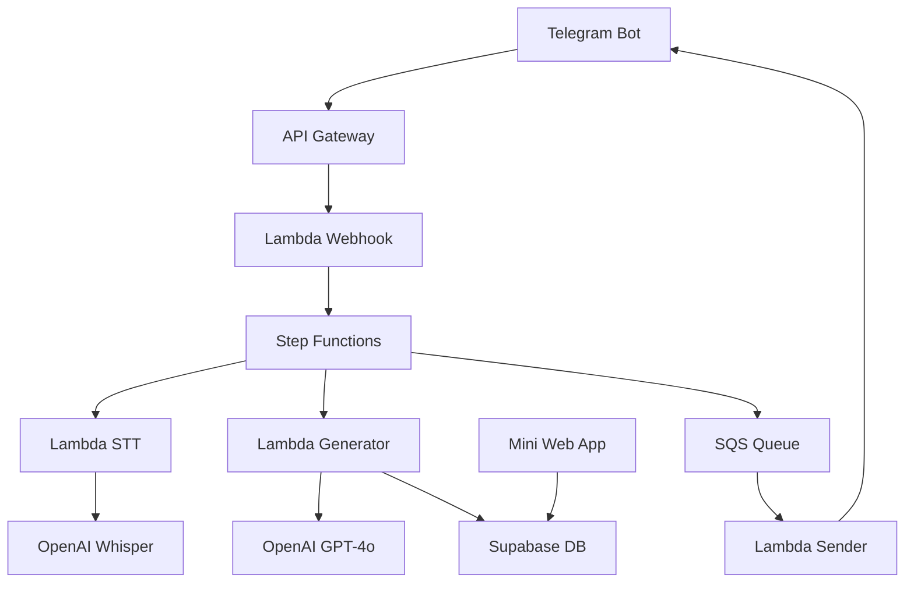

# 🤖 Kriistina Robocorp Bot

> Превращайте любую идею (голос, текст или ссылку) в оформленный пост, написанный вашим авторским стилем за считанные секунды.

## 📋 Описание

Kriistina Bot — это AI-сервис, который:

1. **Извлекает авторский стиль** из 10–15 последних постов пользователя
2. **Применяет этот стиль** к новым входящим данным (голос, текст, URL)
3. **Генерирует готовые посты** в Markdown V2 для Telegram
4. **Предоставляет Mini Web App** для настройки профиля стиля

## 🏗️ Архитектура

### Компоненты системы



### Технологический стек

- **Backend**: AWS Lambda (Python 3.12), Step Functions, SQS, S3
- **Database**: Supabase (PostgreSQL) с Row Level Security
- **AI Services**: OpenAI GPT-4o, OpenAI Whisper
- **Frontend**: React 18 + TypeScript, Telegram Web App SDK
- **Infrastructure**: AWS SAM, CloudFormation

## 🚀 Быстрый старт

### Предварительные требования

- AWS CLI настроенный с правильными credentials
- AWS SAM CLI установлен
- Node.js 18+ для Mini Web App
- Telegram Bot Token
- OpenAI API Key
- Supabase проект

### 1. Клонирование и настройка

```bash
git clone <repository-url>
cd kriistina_robocorp_bot
```

### 2. Создание Supabase проекта

1. Зайдите на [supabase.com](https://supabase.com) и создайте новый проект
2. Выполните миграцию базы данных:

```bash
# Установите Supabase CLI
npm install -g supabase

# Подключитесь к проекту
supabase link --project-ref <your-project-ref>

# Примените миграции
supabase db push
```

### 3. Настройка AWS Secrets Manager

Создайте секреты в AWS Secrets Manager:

```bash
aws secretsmanager create-secret \
  --name "TELEGRAM_BOT_TOKEN" \
  --secret-string "YOUR_TELEGRAM_BOT_TOKEN"

aws secretsmanager create-secret \
  --name "OPENAI_API_KEY" \
  --secret-string "YOUR_OPENAI_API_KEY"

aws secretsmanager create-secret \
  --name "SUPABASE_API_KEY" \
  --secret-string "YOUR_SUPABASE_API_KEY"
```

### 4. Деплой Lambda функций

```bash
# Установите зависимости для каждой функции
cd src/lambda/webhook && pip install -r requirements.txt && cd ../../..
cd src/lambda/sender && pip install -r requirements.txt && cd ../../..
cd src/lambda/stt && pip install -r requirements.txt && cd ../../..
cd src/lambda/generator && pip install -r requirements.txt && cd ../../..

# Деплой через SAM
sam build
sam deploy --guided
```

При первом деплое введите параметры:
- `Environment`: dev или prod
- `TelegramBotToken`: ваш токен Telegram бота
- `OpenAIAPIKey`: ваш ключ OpenAI API
- `SupabaseURL`: URL вашего Supabase проекта
- `SupabaseAPIKey`: anon/public ключ Supabase

### 5. Настройка Telegram webhook

После деплоя получите URL webhook из outputs и настройте его:

```bash
curl -X POST "https://api.telegram.org/bot<YOUR_BOT_TOKEN>/setWebhook" \
  -H "Content-Type: application/json" \
  -d '{"url": "https://<your-api-gateway-url>/webhook/<bot-token-prefix>"}'
```

### 6. Деплой Mini Web App

```bash
cd webapp

# Установите зависимости
npm install

# Создайте .env файл
cat > .env << EOF
REACT_APP_SUPABASE_URL=https://your-project.supabase.co
REACT_APP_SUPABASE_ANON_KEY=your-anon-key
EOF

# Соберите приложение
npm run build

# Деплойте на статический хостинг (GitHub Pages, Netlify, Vercel)
# Или загрузите в S3 + CloudFront
```

## ⚙️ Конфигурация

### Переменные окружения

| Переменная | Описание | Обязательная |
|------------|----------|---------------|
| `TELEGRAM_BOT_TOKEN` | Токен Telegram бота | ✅ |
| `OPENAI_API_KEY` | Ключ OpenAI API | ✅ |
| `SUPABASE_URL` | URL Supabase проекта | ✅ |
| `SUPABASE_API_KEY` | Anon ключ Supabase | ✅ |
| `CONTENT_BUCKET_NAME` | Имя S3 bucket для временных файлов | ✅ |

### Настройка Telegram бота

Добавьте команды бота через @BotFather:

```
/start - Начать работу
/mystyle - Открыть редактор стиля
/help - Помощь
```

Настройте меню:

```json
{
  "commands": [
    {"command": "mystyle", "description": "🎨 Настроить стиль письма"},
    {"command": "help", "description": "❓ Помощь"}
  ]
}
```

## 📊 Мониторинг

### CloudWatch Metrics

Система автоматически отправляет метрики:

- `ProcessingLatency` - время обработки запросов
- `ErrorRate` - частота ошибок
- `ActiveUsers` - количество активных пользователей

### Логи

Все Lambda функции пишут структурированные логи в CloudWatch:

```python
logger.info(f"Processing request for user {user_id}")
logger.error(f"Error processing audio: {error}")
```

### Алерты

Настройте CloudWatch алерты для:
- Высокое время отклика (>60 сек)
- Ошибки в Lambda функциях
- Заполненность DLQ

## 🔒 Безопасность

### Row Level Security (RLS)

Все таблицы Supabase защищены RLS политиками:

```sql
-- Пользователи видят только свои данные
create policy "Users can view own styles"
    on public.user_styles for select
    using (auth.uid()::bigint = user_id);
```

### Секреты

- Все API ключи хранятся в AWS Secrets Manager
- Применяется принцип минимальных привилегий для IAM ролей
- HTTPS/TLS 1.3 для всех соединений

## 📱 Использование

### Базовые команды

1. **Отправьте голосовое сообщение** - бот транскрибирует и создаст пост
2. **Отправьте текст** - бот переработает в ваш стиль
3. **Отправьте ссылку** - бот извлечет контент и создаст пост
4. **Используйте `/mystyle`** - откроет редактор профиля стиля

### Настройка стиля

Через Mini Web App можно настроить:
- **Описание стиля**: общая характеристика манеры письма
- **Словарь**: предпочитаемые и избегаемые слова
- **Параметры**: тон, формальность, использование эмодзи
- **Примеры**: образцы ваших постов для обучения AI

## 🔧 Разработка

### Структура проекта

```
├── src/
│   ├── lambda/           # Lambda функции
│   │   ├── webhook/      # Прием webhook от Telegram
│   │   ├── sender/       # Отправка сообщений
│   │   ├── stt/          # Speech-to-Text обработка
│   │   └── generator/    # Генерация постов
│   └── stepfunctions/    # Определения Step Functions
├── webapp/               # Mini Web App
│   ├── src/
│   │   ├── components/   # React компоненты
│   │   └── App.tsx       # Главный компонент
│   └── package.json
├── supabase/
│   └── migrations/       # Миграции базы данных
├── template.yaml         # SAM template
└── README.md
```

### Локальная разработка

```bash
# Запуск Lambda функций локально
sam local start-api

# Разработка Mini Web App
cd webapp
npm start
```

### Тестирование

```bash
# Тестирование Lambda функций
cd src/lambda/webhook
python -m pytest tests/

# Тестирование React компонентов
cd webapp
npm test
```

## 🐛 Устранение неполадок

### Частые проблемы

1. **Lambda timeout**: Увеличьте timeout в `template.yaml`
2. **Ошибки STT**: Проверьте размер аудиофайла (<20MB)
3. **RLS ошибки**: Убедитесь в правильной настройке auth в Supabase

### Логи и отладка

```bash
# Просмотр логов Lambda
sam logs -n WebhookFunction --stack-name kriistina-bot

# Мониторинг Step Functions
aws stepfunctions list-executions --state-machine-arn <arn>
```

## 📈 Масштабирование

### Production настройки

1. **Увеличьте память Lambda** до 1024MB для STT/Generator
2. **Настройте AutoScaling** для concurrent executions
3. **Используйте CloudFront** для Mini Web App
4. **Добавьте Redis** для кеширования стилей

### Мониторинг производительности

- Настройте X-Ray трейсинг
- Используйте CloudWatch Insights для анализа логов
- Мониторьте стоимость через Cost Explorer

## 📄 Лицензия

Этот проект использует MIT лицензию. См. файл LICENSE для подробностей.

## 🤝 Контрибьюции

1. Fork проекта
2. Создайте feature branch
3. Commit изменения
4. Push в branch
5. Создайте Pull Request

## 📞 Поддержка

При возникновении проблем:
1. Проверьте Issues в репозитории
2. Создайте новый Issue с подробным описанием
3. Приложите логи и конфигурацию (без секретов!)

---

**Версия**: 1.0.0  
**Последнее обновление**: 2024  
**Статус**: Production Ready ✅ 